# 📊 PHÂN TÍCH SÂU: CẤU TRÚC MỚI (SIMPLIFIED - STORYTELLING ONLY)

Ah tôi hiểu rồi! Bạn muốn:

- **Bỏ hẳn tình tiết mang dao** (quá phức tạp và không thực tế)
- **Chỉ có 2 ending chính**: Thú nhận vs Không thú nhận
- **Phần "không thú nhận"** chỉ là **storytelling** kể cuộc đời Đức đen tối ra sao

---

## ✅ CẤU TRÚC MỚI ĐƠN GIẢN HÓA

```mermaid
graph TD
    S27[Scene 27: Gặp tụi bắt nạt<br/>LỰA CHỌN DUY NHẤT]

    S27 -->|Đối mặt 1v1| FIGHT[FightCutscene: Đánh nhau]
    FIGHT --> S28A[Scene 28A: Về nhà sau thắng<br/>Dialogue ngắn]
    S28A --> STORY1[STORYTELLING:<br/>Ending 1 - Good]

    S27 -->|Bị đánh| S28B[Scene 28B: Về nhà<br/>LỰA CHỌN CUỐI CÙNG]

    S28B -->|Thú nhận với mẹ| STORY2[STORYTELLING:<br/>Ending 2 - True]
    S28B -->|Giấu mẹ| STORY3[STORYTELLING:<br/>Ending 3 - Bad Dark Life]

    style S27 fill:#ff6b6b
    style S28B fill:#ffd43b
    style STORY1 fill:#51cf66
    style STORY2 fill:#4dabf7
    style STORY3 fill:#212529
```



---

## 🎬 CHI TIẾT CẤU TRÚC MỚI (CỰC KỲ ĐơN GIẢN)

### **SCENE 27: Điểm quyết định đầu tiên (GIỮ NGUYÊN)**

- **Chế độ**: Visual Novel / Top-down
- **3 lựa chọn ban đầu**:
  - **Đối mặt 1v1** → FightCutscene → Scene 28A → **Ending 1**
  - **Chơi Tù xì** → Bị đánh → Scene 28B
  - **Từ chối** → Bị đánh → Scene 28B

---

### **SCENE 28A: Về nhà sau khi thắng (ENDING 1 - Good_StandUp)**

- **Chế độ**: Visual Novel (dialogue ngắn)
- **Nội dung**:
  - Đức về nhà với vết thương
  - Mẹ hỏi → Đức thú nhận
  - Mẹ lo lắng, hứa giúp đỡ
- **Kết thúc**: Chuyển sang **STORYTELLING Ending 1**

**Dialogue (ngắn gọn - 3-4 nodes):**

```json
{
  "conversationName": "CriticalDay_Scene28A_Home_AfterWin",
  "startNodeId": 0,
  "nodes": [
    {
      "id": 0,
      "speaker": "Mẹ",
      "isPlayer": false,
      "lines": [
        "Trời đất ơi! Con bị gì thế này?",
        "Sao xây xát khắp người thế?"
      ],
      "next": 10
    },
    {
      "id": 10,
      "speaker": "Đức",
      "isPlayer": true,
      "lines": [
        "Mẹ ơi... con bị bắt nạt suốt mấy tuần nay.",
        "Chiều nay con chịu hết nổi rồi nên đánh lại.",
        "Con thắng rồi mẹ... nhưng con sợ lắm..."
      ],
      "next": 20
    },
    {
      "id": 20,
      "speaker": "Mẹ",
      "isPlayer": false,
      "lines": [
        "Sao con giấu mẹ chuyện này?",
        "Mẹ lo cho con muốn chết!",
        "Để mẹ gọi cho cô giáo ngay, nhà trường phải can thiệp."
      ],
      "next": -1,
      "setFlags": ["confessed_to_mom", "ending1_good_standup"],
      "actionId": "trigger_ending1_storytelling"
    }
  ]
}
```

---

### **SCENE 28B: Về nhà - Điểm quyết định CUỐI CÙNG**

- **Chế độ**: Visual Novel
- **Nội dung**: Mẹ hỏi → **LỰA CHỌN DUY NHẤT**
  - **A. Thú nhận** → **STORYTELLING Ending 2 (True)**
  - **B. Giấu mẹ** → **STORYTELLING Ending 3 (Bad - Dark Life)**

**Dialogue:**

```json
{
  "conversationName": "CriticalDay_Scene28B_Home_Choice",
  "startNodeId": 0,
  "nodes": [
    {
      "id": 0,
      "speaker": "Mẹ",
      "isPlayer": false,
      "lines": [
        "Về rồi đấy à? Sao nay về trễ thế con?",
        "Con bị gì thế, sao xây xát khắp người thế này?",
        "Mày có bị sao không con?"
      ],
      "choices": [
        {
          "text": "Mẹ ơi... con bị bắt nạt... (Thú nhận)",
          "next": 100,
          "setTrue": ["confessed_to_mom", "ending2_true_tellparents"]
        },
        {
          "text": "Dạ không có gì đâu mẹ... (Giấu mẹ)",
          "next": 200,
          "setTrue": ["hid_from_mom", "ending3_bad_darklife"]
        }
      ]
    },
    {
      "id": 100,
      "speaker": "Đức",
      "isPlayer": true,
      "lines": [
        "Mẹ ơi... con bị bắt nạt suốt mấy tuần nay...",
        "Tụi nó chặn đường con, đòi tiền, rồi đánh con...",
        "Con sợ lắm mẹ ơi... con không muốn đi học nữa đâu..."
      ],
      "next": 110
    },
    {
      "id": 110,
      "speaker": "Mẹ",
      "isPlayer": false,
      "lines": [
        "Ôi con trai mẹ, sao con giấu mẹ chuyện này?",
        "Đừng khóc nữa con, mẹ ở đây mà.",
        "Để mẹ lo cho con. Mẹ sẽ gọi cho cô giáo ngay."
      ],
      "next": -1,
      "actionId": "trigger_ending2_storytelling"
    },
    {
      "id": 200,
      "speaker": "Đức",
      "isPlayer": true,
      "lines": [
        "Dạ không có gì đâu mẹ...",
        "Con đi đường không để ý lỡ vấp cục đá nên té thôi.",
        "Con lên phòng trước đây mẹ."
      ],
      "next": 210
    },
    {
      "id": 210,
      "speaker": "Mẹ",
      "isPlayer": false,
      "lines": [
        "Mắt mày để đâu mà đi đứng không cẩn thận thế con...",
        "Nhưng tao thấy mày lạ lắm con...",
        "Có chuyện gì nhớ phải nói với mẹ nghe chưa?"
      ],
      "next": 220
    },
    {
      "id": 220,
      "speaker": "Đức",
      "isPlayer": true,
      "lines": ["Dạ vâng, con biết rồi.", "(Mình không muốn mẹ lo...)"],
      "next": -1,
      "actionId": "trigger_ending3_storytelling"
    }
  ]
}
```

---

## 📖 STORYTELLING ENDINGS (TEXT-BASED)

### **ENDING 1: Good_StandUp - "Sẽ có những con cá phải giả chó"**

```
[Màn hình đen - Text cuộn chậm]

Tối hôm đó...

Mẹ Đức gọi điện cho cô giáo chủ nhiệm.

Nhà trường phối hợp với công an xử lý tụi bắt nạt.

---

Sáng hôm sau...

Cô giáo gọi Đức lên phòng, hỏi thăm và an ủi.

"Em đừng lo nữa nhé. Cô sẽ xử lý chuyện này."

---

Trong một tuần...

Hai bạn trong lớp tình nguyện đi cùng Đức về nhà.

"Ê Đức, đi về cùng tụi tao nhé. Có tụi tao đây, tụi nó không dám làm gì đâu."

Tụi bắt nạt không dám xuất hiện nữa.

---

Một tháng sau...

Đức dần mở lòng với bạn bè.

Những người bạn mới giúp Đức vượt qua nỗi sợ hãi.

Đức học cách đứng lên cho bản thân...

Nhưng cũng biết khi nào cần nhờ người lớn giúp đỡ.

---

[Ảnh: Đức cười cùng bạn bè trên sân trường]

Cuộc sống không phải lúc nào cũng dễ dàng.

Nhưng khi bạn có dũng khí đứng lên...

Và tìm kiếm sự giúp đỡ từ những người xung quanh...

Bạn sẽ không còn cô đơn nữa.

---

ENDING 1: SẼ CÓ NHỮNG CON CÁ PHẢI GIẢ CHÓ

"Đứng lên chống lại bạo lực, và tìm kiếm sự giúp đỡ từ gia đình và nhà trường."

[THE END]
```

---

### **ENDING 2: True_TellParents - "Chia sẻ với gia đình"**

```
[Màn hình đen - Text cuộn chậm]

Đức khóc trong vòng tay mẹ.

Lần đầu tiên sau nhiều tuần, Đức cảm thấy nhẹ lòng.

Mẹ vuốt tóc con, an ủi:

"Con đừng sợ nữa. Mẹ ở đây mà."

---

Tối hôm đó...

Mẹ Đức gọi điện cho cô giáo và báo cảnh sát.

Nhà trường và công an phối hợp điều tra.

Phát hiện tụi bắt nạt dính líu đến chất cấm.

Chúng bị đưa lên phường quản thúc, sau đó vào trại giáo dưỡng.

---

Một tuần sau...

Mẹ Đức quyết định cho con chuyển trường.

"Con ơi, mẹ đã tìm được trường mới rồi. Gần nhà hơn, an toàn hơn."

"Mẹ sẽ đưa đón con mỗi ngày. Mẹ sẽ không để con phải trải qua chuyện này nữa."

---

Sáng ngày đầu tiên ở trường mới...

Đức vẫn còn e dè, nhưng không còn sợ hãi như trước.

Vì Đức biết: Mẹ luôn ở đây, sẵn sàng bảo vệ con.

Và lần này, Đức sẽ không giấu giếm nữa.

---

Một năm sau...

Đức đã có những người bạn mới.

Đức học cách chia sẻ, học cách tin tưởng.

Đôi khi Đức vẫn nhớ lại những ngày tháng đen tối...

Nhưng giờ đây, Đức biết mình không còn cô đơn nữa.

---

[Ảnh: Đức và mẹ cùng nhau đi dạo]

Gia đình là nơi bạn luôn có thể trở về.

Đừng bao giờ giấu giếm khi bạn gặp khó khăn.

Cha mẹ luôn sẵn sàng giúp đỡ con cái vượt qua mọi thử thách.

---

ENDING 2: CHIA SẺ VỚI GIA ĐÌNH

"Khi bạn chia sẻ với gia đình, bạn không còn phải đối mặt với khó khăn một mình."

[THE END]
```

---

### **ENDING 3: Bad_DarkLife - "Cuộc đời đen tối"**

```
[Màn hình đen - Text cuộn chậm, âm nhạc u ám]

Đức nằm trên giường, nhìn trần nhà.

Vết thương trên người đau nhức.

Nhưng đau hơn cả là nỗi sợ hãi trong lòng.

"Mai... lại phải gặp tụi nó nữa rồi..."

---

Ngày hôm sau...

Đức đi học với tâm trạng nặng nề.

Trên lớp, Đức không thể tập trung.

Mỗi tiếng động đều khiến Đức giật mình.

---

Chiều về...

Tụi bắt nạt lại chặn đường.

"Ê mày, lại đây! Hôm nay tụi tao có trò chơi mới cho mày đây."

Đức run rẩy, đưa hết tiền trong túi.

Nhưng chúng vẫn không tha.

Bụp! Bụp! Bụp!

---

Một tuần sau...

Đức bắt đầu trốn học.

Mỗi sáng, Đức nói dối mẹ là đi học.

Nhưng thực ra, Đức chỉ lang thang ngoài đường.

Ngồi trong công viên, nhìn những đứa trẻ khác vui chơi.

---

Một tháng sau...

Nhà trường gọi điện cho mẹ Đức.

"Cháu Đức đã nghỉ học 3 tuần liên tục rồi ạ."

Mẹ Đức sốc, hỏi con.

Đức vẫn giấu: "Con bị ốm mẹ ạ..."

---

Hai tháng sau...

Đức hoàn toàn bỏ học.

Mẹ Đức phát hiện ra sự thật, nhưng đã quá muộn.

Đức đã mất hết niềm tin vào mọi người.

Đức nhốt mình trong phòng, không muốn gặp ai.

---

Sáu tháng sau...

Đức bắt đầu có những suy nghĩ tiêu cực.

"Tại sao mình phải sống?"

"Tại sao mình lại yếu đuối đến thế?"

"Tại sao không ai hiểu mình?"

---

Một năm sau...

Đức vẫn chưa quay lại trường.

Mẹ Đức đã già đi rất nhiều, tóc bạc trắng.

Mẹ tự trách mình: "Tại sao mẹ không nhận ra sớm hơn..."

Nhưng giờ đây, đã quá muộn.

---

Nhiều năm sau...

Đức trở thành một người trưởng thành...

Nhưng vẫn mang trong mình những vết thương tâm lý.

Sợ đám đông. Sợ giao tiếp. Sợ tin tưởng người khác.

Cuộc đời Đức như một bóng tối...

Không bao giờ tìm thấy ánh sáng.

---

[Ảnh: Silhouette của Đức ngồi một mình trong bóng tối]

Im lặng chịu đựng không phải là sức mạnh.

Đó là sự yếu đuối khiến bạn mất đi chính mình.

Khi bạn giấu giếm nỗi đau...

Bạn đang tự giam mình trong một nhà tù vô hình.

---

Và đôi khi...

Nhà tù đó sẽ theo bạn suốt đời.

---

ENDING 3: CUỘC ĐỜI ĐEN TỐI

"Im lặng chịu đựng bạo lực có thể hủy hoại cả cuộc đời bạn. Đừng bao giờ giấu giếm khi bị bắt nạt."

[THE END]
```

---

## 📊 SO SÁNH CUỐI CÙNG

| Tiêu chí                    | Trước (4 endings phức tạp) | Sau (3 endings đơn giản)   | Cải thiện |
| --------------------------- | -------------------------- | -------------------------- | --------- |
| **Số ending**               | 4                          | 3                          | -25%      |
| **Số scene cần tạo**        | 24-28                      | **3** (Scene 27, 28A, 28B) | **-90%**  |
| **Số dialogue nodes**       | 200-300                    | **~30-40**                 | **-85%**  |
| **Có tình tiết mang dao**   | Có (phức tạp)              | **Không** (đơn giản hơn)   | ✅        |
| **Có tình tiết giết người** | Có (quá nặng)              | **Không** (phù hợp hơn)    | ✅        |
| **Có tình tiết chết**       | Có (quá bi kịch)           | **Không** (realistic hơn)  | ✅        |
| **Thời gian mỗi ending**    | 15-21 phút                 | **3-5 phút**               | **-75%**  |
| **Công sức phát triển**     | Rất cao                    | **Rất thấp**               | **-90%**  |
| **Message rõ ràng**         | Bị loãng                   | **Rất rõ ràng**            | ✅        |

---

## 🎯 CẤU TRÚC CUỐI CÙNG (SIMPLIFIED)

### **Tổng quan:**

1. **Scene 27**: Gặp tụi bắt nạt (3 lựa chọn → 2 nhánh)

   - Đối mặt 1v1 → Scene 28A
   - Bị đánh (2 lựa chọn khác) → Scene 28B

2. **Scene 28A**: Về nhà sau thắng (dialogue ngắn) → **Storytelling Ending 1**

3. **Scene 28B**: Về nhà sau bị đánh (2 lựa chọn cuối)
   - Thú nhận → **Storytelling Ending 2**
   - Giấu mẹ → **Storytelling Ending 3**

### **Tổng số scene cần tạo: 3**

- `CriticalDay_Scene27_Street.json` (đã có)
- `CriticalDay_Scene28A_Home_AfterWin.json` (mới)
- `CriticalDay_Scene28B_Home_Choice.json` (mới)

### **Tổng số storytelling cần viết: 3**

- `Ending1_Good_StandUp_Storytelling.txt`
- `Ending2_True_TellParents_Storytelling.txt`
- `Ending3_Bad_DarkLife_Storytelling.txt`

---

## ✅ LỢI ÍCH CỦA CẤU TRÚC MỚI

### **1. Đơn giản hơn rất nhiều**

- Bỏ hẳn tình tiết **mang dao** (không thực tế với học sinh cấp 2)
- Bỏ hẳn tình tiết **giết người** (quá nặng, không phù hợp)
- Bỏ hẳn tình tiết **chết** (quá bi kịch)
- Chỉ tập trung vào **hậu quả tâm lý** của việc giấu giếm

### **2. Realistic hơn**

- **Ending 3** (Bad) giờ là **cuộc đời đen tối** thay vì chết/giết người
- Phản ánh đúng **hậu quả thực tế** của bạo lực học đường:
  - Bỏ học
  - Trầm cảm
  - Sợ giao tiếp
  - Tổn thương tâm lý suốt đời

### **3. Message mạnh mẽ hơn**

- **Ending 1**: Đứng lên + Tìm kiếm giúp đỡ = Thành công
- **Ending 2**: Thú nhận với gia đình = Được cứu
- **Ending 3**: Im lặng = Hủy hoại cả cuộc đời

### **4. Dễ phát triển hơn 90%**

- Chỉ cần tạo **3 scene dialogue** (thay vì 24-28)
- Chỉ cần viết **3 storytelling** (text thuần, không cần asset)
- Không cần cutscene phức tạp (đâm chết, đánh chết, tòa án, đám tang...)

---

## 🛠️ KẾ HOẠCH THỰC HIỆN

### **Bước 1: Tạo Scene 28A (Về nhà sau thắng)**

```
File: CriticalDay_Scene28A_Home_AfterWin.json
Nodes: 3-4 nodes
Kết thúc: actionId = "trigger_ending1_storytelling"
```

### **Bước 2: Tạo Scene 28B (Về nhà - Lựa chọn cuối)**

```
File: CriticalDay_Scene28B_Home_Choice.json
Nodes: 6-7 nodes (2 nhánh)
Kết thúc:
  - Nhánh 1: actionId = "trigger_ending2_storytelling"
  - Nhánh 2: actionId = "trigger_ending3_storytelling"
```

### **Bước 3: Tạo Storytelling System**

```csharp
// Component: StorytellingSequence.cs
// Hiển thị text cuộn + ảnh (optional)
// Tự động chuyển về main menu sau khi xong
```

### **Bước 4: Viết 3 storytelling**

- Ending 1: ~300-400 từ
- Ending 2: ~300-400 từ
- Ending 3: ~500-600 từ (dài hơn vì kể nhiều năm)

---

## 📝 KẾT LUẬN

Cấu trúc mới này:

- ✅ **Cực kỳ đơn giản**: Chỉ 3 scene dialogue + 3 storytelling
- ✅ **Realistic**: Không có tình tiết phi thực tế (dao, giết người, chết)
- ✅ **Message mạnh**: Tập trung vào hậu quả tâm lý thực tế
- ✅ **Dễ phát triển**: Giảm 90% công sức so với bản gốc
- ✅ **Phù hợp indie game**: Ít resource, tập trung vào storytelling

Bạn có muốn tôi bắt đầu tạo các file JSON cho Scene 28A và 28B không?
